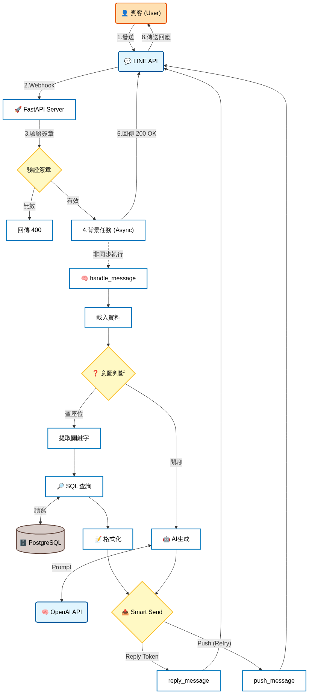
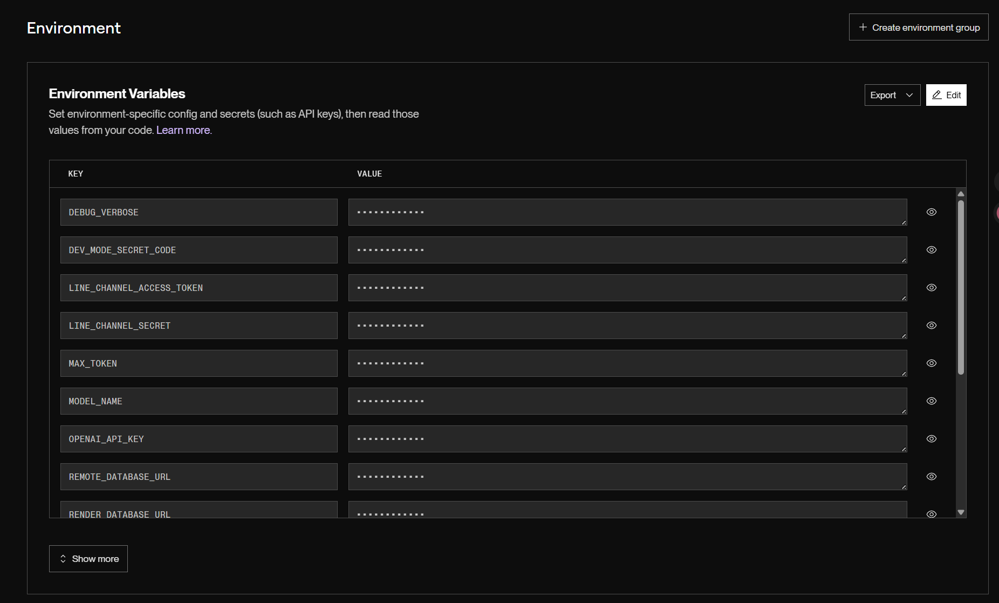
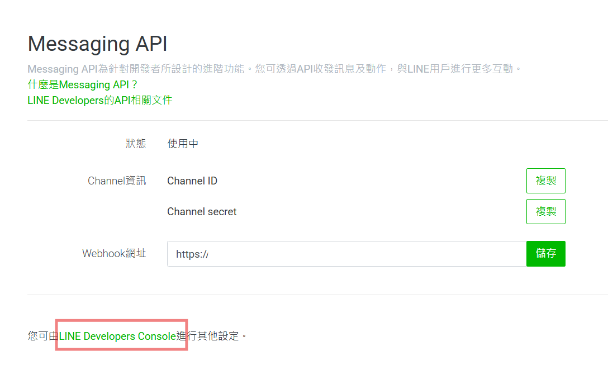
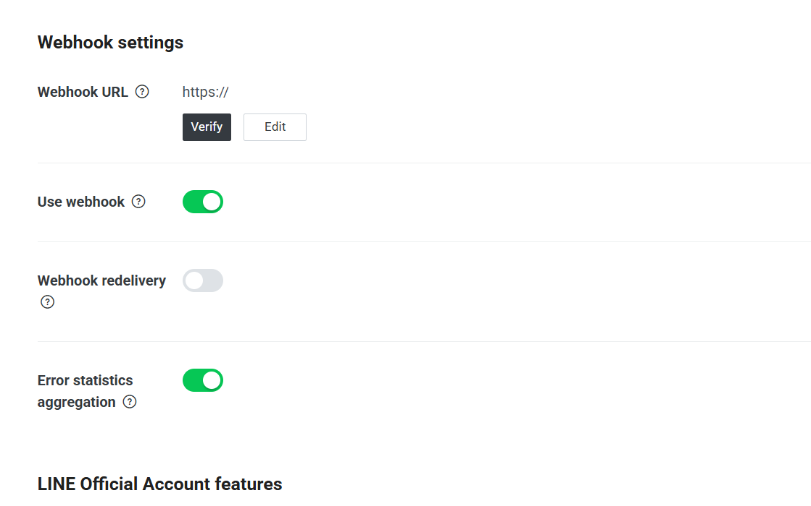
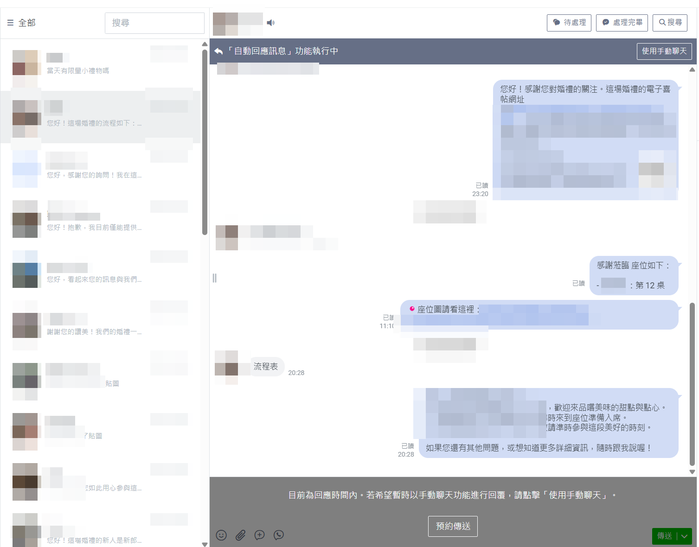

[English](README.en.md) | 中文
# Wedding AI Assistant


一個部署在 Render 的婚禮 LINE Bot 後端：  
- **查座位**：用姓名/暱稱查詢來賓與同桌家人座位（PostgreSQL）  
- **一般問答**：讀取婚禮資訊（JSON Context）並透過 OpenAI 產生回覆  
- **靜態座位圖**：由 FastAPI 掛載 `/static` 提供座位圖網址（可在查到桌號時回傳）

> 本專案設計重點：**環境變數分層**（本機 `.env` / Render Dashboard env vars）、**資料庫連線優先序**、以及 **LINE Webhook 非同步處理**（BackgroundTasks）。

---

## 目錄
- [功能概覽](#功能概覽)
- [系統架構](#系統架構)
- [技術棧](#技術棧)
- [安全與隱私提醒](#安全與隱私提醒)
- [快速開始（本機開發）](#快速開始本機開發)
- [環境變數設計與分層（特別注意）](#環境變數設計與分層特別注意)
- [資料庫（PostgreSQL）初始化與匯入來賓](#資料庫postgresql初始化與匯入來賓)
- [LINE Developers 設定（Webhook）](#line-developers-設定webhook)
- [Render 部署（Web Service + PostgreSQL）](#render-部署web-service--postgresql)
- [靜態資產（座位圖）](#靜態資產座位圖)
- [Keep Alive（可選）](#keep-alive可選)
- [常見問題與除錯](#常見問題與除錯)

---

## 功能概覽
1. **健康檢查**
   - `GET /` → `{"status":"ok","message":"Wedding AI Assistant is alive."}`

2. **LINE Webhook**
   - `POST /webhook`
   - 會驗證 `X-Line-Signature`（channel secret）
   - 驗證通過後把訊息交給背景任務處理（避免 webhook timeout）

3. **意圖判斷（intents.py）**
   - 目前只有 `seat_lookup`
   - 若判斷為查座位 → 取關鍵字 → 查 DB → 回覆座位資訊 +（若有桌號）推座位圖 URL

4. **婚禮資訊 Context（data_provider.py）**
   - 兩種來源：
     - `WEDDING_CONTEXT_JSON`（環境變數 JSON 字串，推薦用於 Render）
     - `WEDDING_CONTEXT_PATH`（檔案路徑，預設 `instance/wedding_data.json`，推薦本機）

5. **AI 回覆（ai_core.py）**
   - 使用 OpenAI Chat Completions
   - `SYSTEM_PROMPT_PATH` 可指定系統提示詞檔案（預設 `prompts/system.txt`）

---

## 系統架構
### 流程圖

<p align="center">
  
</p>

1. 使用者在 LINE 發訊息
2. LINE Platform 呼叫 Render 上的 `/webhook`
3. 後端驗證簽章
4. 背景處理：`handle_message()` → （查 DB 或呼叫 OpenAI）→ `_smart_send`
5. 回覆優先用 reply token（省額度/即時），失敗再 fallback push
6. 查座位若有桌號，另外 push 座位圖網址（`/static/maps/...`）

## 安全與隱私提醒

- 本專案的來賓座位資訊存放於 PostgreSQL，透過環境變數連線（例如 `RENDER_DATABASE_URL` / `REMOTE_DATABASE_URL`），不會將資料庫憑證或原始名單提交到 Git。
- 但請注意：部署到 Render 後，`static/` 下的資源（例如座位圖 `static/maps/...`）通常是**公開可存取**的；因此座位圖請使用「公開版」素材，避免放入可識別個人的資訊（新人全名、賓客姓名、電話、地址等）。
- 請勿將敏感資訊提交到 Git：包含 `.env`、API keys/tokens、Database URL、以及含個資的賓客名單（CSV/Excel/JSON）。建議僅提交 `*.example` 範例檔作格式參考。
- 若需要更高隱私（例如僅查到座位的人可看座位圖），需自行改造成受保護端點/簽章 URL/短效連結等機制（本專案目前未內建）。

### Render 環境變數設定（範例）


### LINE Developers Console (Webhook)



### End-to-End Demo（LINE 對話 → Webhook → 回覆）

<p align="center">
  
</p>

> 注意：截圖已遮蔽所有個資與敏感憑證（tokens/URLs/IDs）。

## 技術棧
- Python + FastAPI + Uvicorn
- line-bot-sdk-python v3（WebhookParser / MessagingApi）
- PostgreSQL + psycopg2
- OpenAI Python SDK
- Render（Web Service + PostgreSQL）

---

## 快速開始（本機開發）
### 1) 建立虛擬環境與安裝依賴
```bash
cd wedding-ai-assistant

python -m venv venv

# Windows:
venv\Scripts\activate

# macOS/Linux:
# source venv/bin/activate

pip install -r requirements.txt
```

### 2) 建立 .env
```bash
# Windows
copy .env.example .env

# macOS/Linux:
# cp .env.example .env
```
填入必要的環境變數（至少 LINE 與 OpenAI，資料庫依採用的模式）。

### 3) 啟動本機服務
```bash
python main.py
# 預設 http://127.0.0.1:8000
```

### 4) 測試健康檢查：
```bash
curl http://127.0.0.1:8000/
```
本機要收 LINE webhook 通常需要公開網址（ngrok/Cloudflare Tunnel），正式上線建議直接用 Render。

## 環境變數設計與分層（特別注意）

### 核心原則：本機用 `.env`，Render 用 Dashboard Env Vars
- 本機開發：使用 `.env`（`load_dotenv()` 讀取）
- Render 部署：不要上傳 `.env`，改在 Render 的 Web Service 設定 Environment Variables
- `.gitignore` 已排除 `.env`、`instance/wedding_data.json`、以及大部分靜態/資料檔，避免外洩

### 資料庫連線優先序（`db/db_connection.py`）
`get_connection()` 會依序使用：
1. `RENDER_DATABASE_URL`（Render 內部連線，部署在 Render 時最推薦）
2. `REMOTE_DATABASE_URL`（本機連到 Render DB 的外部連線，推薦用於本機維運/匯入）
3. `PG*`（本機 PostgreSQL）

### 婚禮資訊 Context 優先序（`data_provider.py`）
1. `WEDDING_CONTEXT_JSON`（推薦 Render：不需要在檔案系統放私密 `wedding_data.json`）
2. `WEDDING_CONTEXT_PATH`（預設 `instance/wedding_data.json`，推薦本機）

### 環境變數說明（建議維持與 `.env.example` 一致）

#### LINE
- `LINE_CHANNEL_SECRET`：Messaging API channel secret（用於 webhook 簽章驗證）
- `LINE_CHANNEL_ACCESS_TOKEN`：channel access token（用於回覆/推播）

#### OpenAI
- `OPENAI_API_KEY`：OpenAI API Key
- `MODEL_NAME`：預設 `gpt-4.1-nano`
- `MAX_TOKEN`：預設 `150`
- `SYSTEM_PROMPT_PATH`：預設 `prompts/system.txt`

#### Wedding Context
- `WEDDING_CONTEXT_JSON`：JSON 字串（list of blocks）
- `WEDDING_CONTEXT_PATH`：JSON 檔案路徑（預設 `instance/wedding_data.json`）

#### Static
- `STATIC_BASE_URL`：靜態資產 base URL  
  - 本機：`http://127.0.0.1:8000/static`  
  - Render：`https://<your-service>.onrender.com/static`
- `STATIC_FULL_SEATMAP`：座位圖檔名（放在 `static/maps/`），例如 `wedding_map.webp`

#### DB（擇一策略）
- Render 內部：`RENDER_DATABASE_URL`
- 本機連 Render DB：`REMOTE_DATABASE_URL`
- 本機 DB：`PGDATABASE`, `PGUSER`, `PGPASSWORD`, `PGHOST`, `PGPORT`

#### 工具腳本
- `GUESTS_CSV_PATH`：來賓 CSV 路徑（建議相對路徑或本機絕對路徑）
- `KEEP_ALIVE_URL`：keep-alive 目標 URL（可選）
- `DEBUG_VERBOSE`：`true/false`

---

## 資料庫（PostgreSQL）初始化與匯入來賓

本專案提供兩套工具：
- `*_local.py`：走 `PG*`（本機 DB）
- `*_render.py`：走 `RENDER_DATABASE_URL` 或 `REMOTE_DATABASE_URL`（Render DB）

### A. 本機 PostgreSQL（走 `PG*`）
先確保 `.env` 有設定 `PG*`（或本機 DB）。

初始化 schema + seed groups：
```bash
python tools/seed_loader_local.py
```

匯入來賓 CSV（會清空 `guests` 後重匯）：
```bash
python tools/guest_loader_local.py
```
### B. Render PostgreSQL（推薦：用 DB URL）

Render 的 DB 通常會提供：
- **Internal Database URL**：Render 內網用（適合部署服務）
- **External Database URL**：本機維運用（適合在本機跑匯入腳本）

建議做法：

- Render Web Service 設定：`RENDER_DATABASE_URL = Internal Database URL`
- 本機 `.env` 設定：`REMOTE_DATABASE_URL = External Database URL`

初始化 schema + seed groups（對 Render DB）
```bash
python tools/seed_loader_render.py
# 或 python tools/init_db.py（只建 schema）
```

匯入來賓 CSV（對 Render DB）
```bash
python tools/guest_loader_render.py
```

> 注意：Render 的 Web Service 檔案系統不適合放正式來賓名單 CSV。正確流程是：在本機用 External Database URL 把資料匯進 Render DB。

## LINE Developers 設定（Webhook）
### 1) 建立 Messaging API Channel
到 LINE Developers Console：
1. 建立 Provider
2. 建立 Messaging API Channel

取得：

- Channel secret → `LINE_CHANNEL_SECRET`
- Channel access token（長期）→ `LINE_CHANNEL_ACCESS_TOKEN`

### 2) Webhook URL 設定

假設 Render 服務網址是：
`https://<your-service>.onrender.com`

Webhook URL 設定為：
`https://<your-service>.onrender.com/webhook`

在 LINE Console：

- Webhook settings → 填入 URL
- 啟用 Use webhook
- 按 Verify（需要服務已部署且可連）

### 3) 建議同步調整（避免干擾）

- Auto-reply / Greeting messages：如果要完全由後端控制回覆，建議關閉或至少確認行為符合預期
- Bot 的權限與隱私設定：依活動需求調整

## Render 部署（Web Service + PostgreSQL）

> Render 介面可能因版本略有不同，但關鍵概念一致：建立 DB、建立 Web Service、設定環境變數、指定啟動命令。

### 1) 建立 Render PostgreSQL

Render → New → PostgreSQL

建立完成後取得兩個連線字串：

- Internal Database URL（給 Render Web Service 用）
- External Database URL（給本機維運/匯入用）

### 2) 建立 Render Web Service

Render → New → Web Service → 連 GitHub repo

- Runtime：Python
- Build Command（建議）：
```bash
pip install -r requirements.txt
```

- Start Command（建議）：
```bash
uvicorn main:app --host 0.0.0.0 --port $PORT
```
### 3) Render Web Service 環境變數（Dashboard 設定）

至少需要：

- `LINE_CHANNEL_SECRET`
- `LINE_CHANNEL_ACCESS_TOKEN`
- `OPENAI_API_KEY`
- `RENDER_DATABASE_URL`（填 Internal Database URL）
- `STATIC_BASE_URL`：`https://<your-service>.onrender.com/static`
- `STATIC_FULL_SEATMAP`：例如 `wedding_map.webp`

婚禮資訊建議用其中一種：

- 推薦：`WEDDING_CONTEXT_JSON`（直接貼 JSON 字串）
- 或：`WEDDING_CONTEXT_PATH=instance/wedding_data.json`（但 Render 上必須確保檔案存在；通常不推薦放私密檔案在 repo）

### 4) 部署後檢查

- 打開：`https://<your-service>.onrender.com/`（健康檢查）
- 到 LINE Developers Verify webhook
- 用 LINE 實測：
  - 查座位：我要找王小明的座位
  - 一般問答：今天流程是什麼？

## 靜態資產（座位圖）

FastAPI 會掛載 `static/` 到 `/static`

座位圖預設使用：

`STATIC_BASE_URL + /maps/ + STATIC_FULL_SEATMAP`

例如：`https://<your-service>.onrender.com/static/maps/wedding_map.webp`

建議：

- 座位圖檔案放 `static/maps/`
- 以 `webp` 為主（檔案較小、載入快）
- 如果不希望座位圖被公開存取，需另外加上權限/簽名 URL 機制（目前版本未包含）

## Keep Alive（可選）

`tools/keep_alive.py` 會每 5 分鐘 GET 一次 `KEEP_ALIVE_URL`。

使用方式：

1. .env 設定：
    - `KEEP_ALIVE_URL=https://<your-service>.onrender.com/`
2. 執行：
```bash
python tools/keep_alive.py
```

> 是否需要 keep-alive 取決於 Render 方案與服務休眠策略。若服務不會休眠，可不使用。

## 常見問題與除錯
### 1) LINE Verify webhook 失敗

- 確認 Render 服務已成功部署且可開 `GET /`
- Webhook URL 必須是 `https://.../webhook`
- 確認 Render env vars 中 `LINE_CHANNEL_SECRET` 正確
- 查看 Render logs（通常是簽章驗證失敗、路由錯誤、或服務未啟動）

### 2) 回覆失敗 / push 失敗

- `main.py` 有 reply→push fallback + retry + dead-letter：
- `instance/dead_letters.jsonl` 會記錄最終失敗的推播（注意 Render 檔案系統可能非持久）
- 建議在 Render logs 開 `DEBUG_VERBOSE=true` 短期追查（確認後再關閉）

### 3) DB 連不上

- Render 部署：應使用 `RENDER_DATABASE_URL`（Internal）
- 本機維運：應使用 `REMOTE_DATABASE_URL`（External）
- 如果把 Internal URL 拿到本機用，通常會連不到（網路不可達）

### 4) 查座位找不到 / 太多結果

- `queries.py` 有保護機制：
  - keyword 太短 → `too_short`
  - 取到太多 rows → `too_many`
- 建議使用者輸入更完整姓名或更精準暱稱